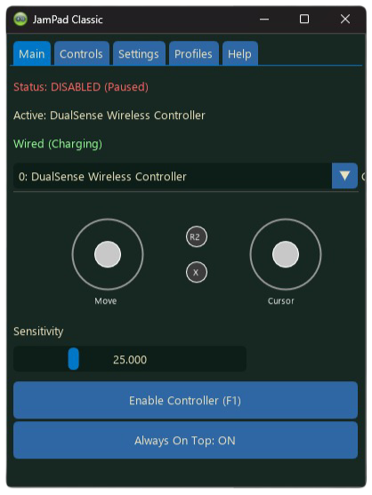

### 👋 Welcome to my first project!

I built **JamPad Classic** purely for fun because I was curious: *"What would it be like to play Animal Jam with a controller?"*

Little did I know, it actually makes the game—especially the minigames and exploring—feel surprisingly fresh and way more fun. I decided to release it open-source so others can try it out!

⚠️ **Note:** This is a hobby project and my first public release. It might not be perfect, but it works great for me. If you find bugs or have ideas to make it better, feel free to let me know in the Issues tab!

# 🎮 JamPad Classic

**JamPad Classic** is a custom controller mapper for **Animal Jam Classic**. It lets you play the game on your PC using an Xbox or PlayStation controller with a smooth, console-like feel.




## ✨ Features

* **Plug & Play:** Works immediately with Xbox and PlayStation controllers (updates button icons automatically).
* **Custom Controls:** Don't like the default buttons? Remap A, B, X, and Y to whatever keys you want in the *Controls* tab.
* **Smart Focus:** The controller only affects the game when the window is active. You can check your battery or change settings in the app without it affecting AJC.
* **Visualizer:** See exactly how your sticks are moving and where your deadzones are in real-time.
* **Audio Cues:** Hears a "Beep" when you toggle the controller ON or OFF so you know it's working.
* **Battery Monitor:** Check your controller battery level right on the main tab.

## 📥 How to Install

### Option 1: For Players (Recommended)
1.  Go to the [**Releases**](https://github.com/RecentProject/JamPad-Classic/releases) page.
2.  Download `JamPad Classic.exe`.
3.  Connect your controller, run the app, and start playing!

### Option 2: For Developers (Source Code)
If you want to modify the code or run it through Python:

**Requirements:** Python 3.14+

```bash
# 1. Clone the repo
git clone https://github.com/RecentProject/JamPad-Classic.git
cd JamPad-Classic

# 2. Install requirements
pip install -r requirements.txt

# 3. Run the app
python "JamPad Classic.py"

